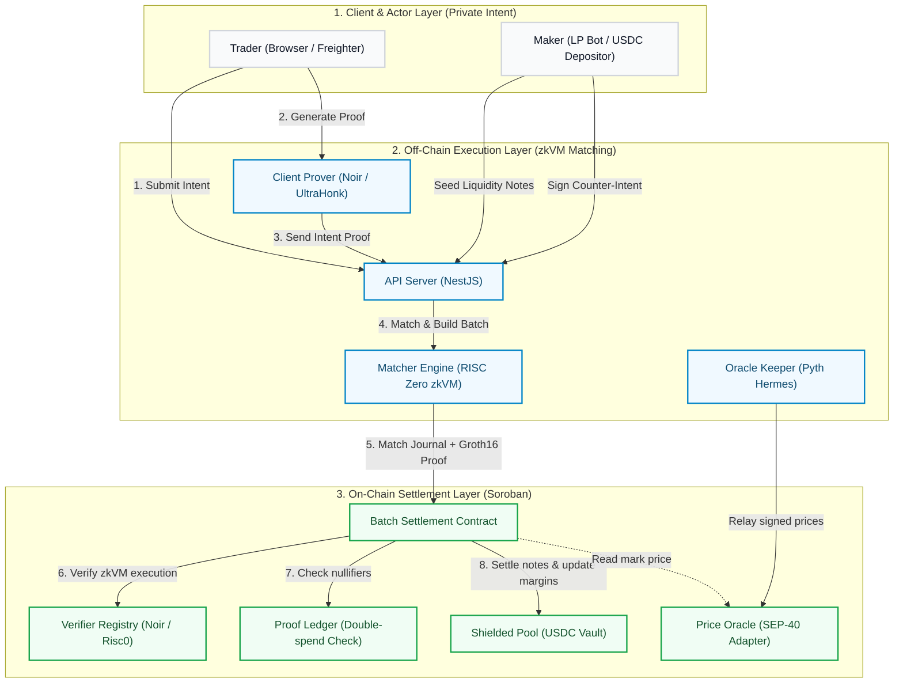
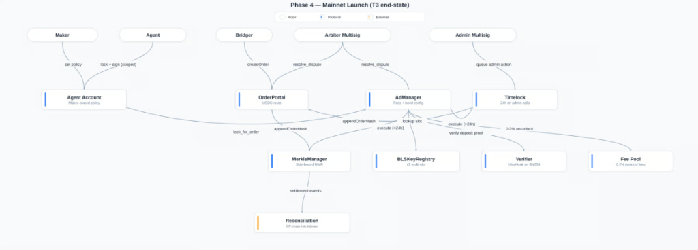

# PNLX Protocol Architecture

PNLX is a zero-knowledge, zkVM-backed private perpetual futures exchange built on the Stellar blockchain. The platform is designed to preserve trader privacy—including account balances, margins, positions, order directions, and liquidations—while leveraging off-chain matching for throughput and on-chain Soroban smart contracts for trustless settlement.

---

## 1. System Architecture Diagram

Below is the conceptual flow diagram dividing the protocol's operations into three distinct processing domains: the Client & Actor Layer, the Off-Chain Execution Layer, and the On-Chain Settlement Layer.

---

## 2. Structural Layer Breakdown

### 2.1 Client & Actor Layer (Private Intent)
*   **Traders**: Authenticate via Freighter-compatible wallets. The browser client creates a **Private Intent**—specifying asset, side, leverage, size, and slippage constraints—without disclosing identity or margin details on-chain.
*   **Makers**: Supply counterparty liquidity by shielding USDC collateral. Makers maintain private note commitments in the matching engine's database, allowing the matcher to auto-sign counter-intents.
*   **Proof Generation**: The client browser utilizes Noir to compile and output a succinct **UltraHonk Proof** certifying that the trader's notes have sufficient margin to cover the order size and that the owner's keys are cryptographically sound.

### 2.2 Off-Chain Execution Layer (zkVM Matching)
*   **API Gateway (NestJS)**: Serves as the central relayer. It processes incoming order intents, collects user proofs, coordinates maker counter-intents, and queues matches.
*   **Prover Worker**: Handles proof generation offloading when client hardware is resource-constrained.
*   **Matcher Engine (RISC Zero zkVM)**: 
  *   Runs deterministic matching rules inside a secure, sandboxed Guest Program.
  *   Accepts buyer/seller private intents, matches them at crossed prices, and splits margin notes.
  *   Outputs an **Execution Journal** along with a **RISC Zero Groth16 SNARK Proof** certifying the match occurred in strict compliance with the protocol rules.

### 2.3 On-Chain Settlement Layer (Soroban)
*   **Batch Settlement**: The entry point for relayer submissions. It unpacks the execution journal, reads the RISC Zero proof, and validates the match on-chain.
*   **Verifier Registry**: Holds WASM-based verifiers for both RISC Zero Groth16 proofs and Noir UltraHonk circuits.
*   **Shielded Pool**: Acts as the custody vault for collateral (USDC). It records note commitments (UTXO roots) and tracks spent note nullifiers to eliminate double-spending risks.
*   **Core Parameters**: Manages market risk specifications (max leverage, margin rates) and queries mark prices from the SEP-40 Price Oracle.

---

## 3. High-End Architecture Diagram Reference

Below is the detailed flow reference map outlining structural entities across the protocol lifecycle:

